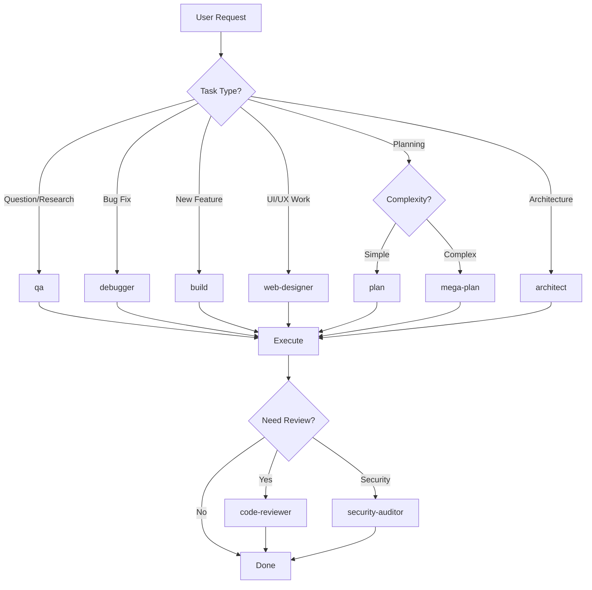
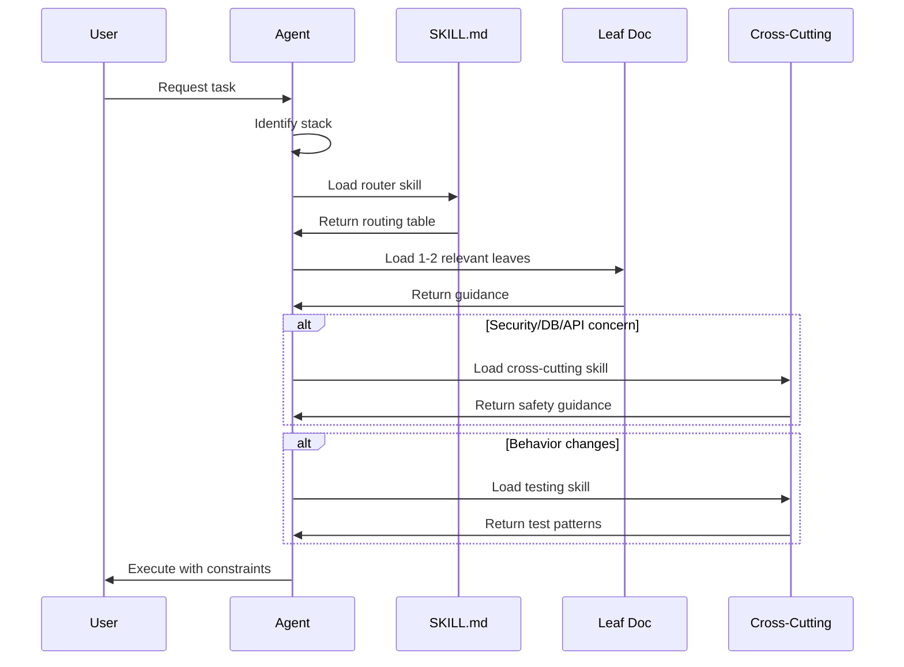
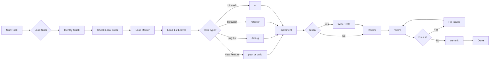

# OpenCode Config + Skill Library

> **Production-grade LLM coding configuration with router-first skill architecture**

This repository contains a comprehensive OpenCode configuration system designed to make AI coding assistants predictable, consistent, and production-quality across projects.

## Table of Contents

1. [Overview](#overview)
2. [Agent Types](#agent-types)
3. [Skills Inventory](#skills-inventory)
4. [Skill Structure & Philosophy](#skill-structure--philosophy)
5. [Commands](#commands)
6. [Configuration](#configuration)
7. [Workflow Guide](#workflow-guide)
8. [Project Setup](#project-setup)
9. [Quality Assurance](#quality-assurance)
10. [Contributing](#contributing)

---

## Overview

This repository provides a complete OpenCode configuration system with:

- **35+ specialized skills** covering languages, frameworks, and cross-cutting concerns
- **Router-first architecture** for precise, minimal context loading
- **18 specialized agents** for different coding tasks
- **25+ custom commands** for common workflows
- **Project-local skill support** for team conventions
- **Guardrails and linting** to prevent skill drift

### Core Philosophy

**Skills are the primary mechanism for consistent output.** Instead of relying on the model's training data, we explicitly load focused, versioned guidance that constrains behavior.

The system follows these principles:

1. **Route first, then implement** - Pick the smallest focused guide that fits
2. **Project-local wins** - Repo-specific conventions override global defaults
3. **Load only what you need** - Prevent context bloat with precise routing
4. **Explicit over implicit** - Decision rules, checklists, and anti-patterns over generic advice

### The Foundational Principle

> **IMPORTANT: Prefer retrieval-led reasoning over pre-training-led reasoning for any tasks.**
>
> **Before writing code, first explore the project structure, then invoke the skills, rules and standards for documentation.**

This principle, inspired by [Vercel's research](https://vercel.com/blog/agents-md-outperforms-skills-in-our-agent-evals), is what makes this entire system work. Instead of letting the AI rely on its training data (which may be outdated, inconsistent, or wrong), we force it to **retrieve** specific, current, project-relevant guidance before acting.

**Why this matters:**

- **Consistency** - Every task follows the same conventions, regardless of which AI model is used
- **Accuracy** - Skills contain up-to-date patterns (2024-2026) rather than potentially stale training data
- **Predictability** - Same input produces same output because constraints are explicit
- **Team alignment** - Project-local skills encode team conventions that everyone follows

This is the glue that binds everything together: the router-first architecture, the skill loading protocol, the guardrails, and the quality checks all serve this single principle—**retrieve before you reason**.

---

## Agent Types

Agents are specialized AI personas configured for specific tasks. Each has tailored permissions, tools, and temperature settings.

### Primary Agents (User-Facing)

| Agent            | Description                       | Temperature | Max Steps | Key Permissions           |
| ---------------- | --------------------------------- | ----------- | --------- | ------------------------- |
| **qa**           | Quick Q&A using codebase and docs | 0.2         | 20        | Read-only (no edits)      |
| **build**        | General coding and implementation | 0.2         | -         | Full tool access          |
| **plan**         | Implementation planning           | 0.1         | -         | Read-only, research only  |
| **mega-plan**    | Deep planning for complex work    | 0.1         | 40        | Docs only, no code edits  |
| **web-designer** | UI/UX with Next.js + Tailwind     | 0.3         | -         | Full tool access          |
| **debugger**     | Bug reproduction and fixing       | 0.2         | -         | Full tool access          |
| **architect**    | Comprehensive system design       | 0.2         | 60        | Docs only, extended steps |

### Subagents (Task-Specific)

| Agent                | Description                  | Temperature | Use Case                   |
| -------------------- | ---------------------------- | ----------- | -------------------------- |
| **code-reviewer**    | Quality, DRY, best practices | 0.1         | Post-implementation review |
| **security-auditor** | Vulnerability detection      | 0.1         | Security-focused review    |
| **docs-writer**      | Documentation generation     | 0.3         | API docs, READMEs          |
| **tdd-coach**        | Red/green/refactor guidance  | 0.2         | Test-driven development    |
| **refactorer**       | Safe code restructuring      | 0.2         | Improving existing code    |
| **planner**          | Implementation plans         | 0.3         | Breaking down work         |
| **optimizer**        | Performance tuning           | 0.2         | Speed/memory optimization  |
| **test-writer**      | Test creation                | 0.25        | Adding test coverage       |

### Agent Selection Flow



---

## Skills Inventory

Skills are the heart of this system. Each skill is a router that points to focused leaf documents.

### Language Skills

| Skill          | Description                   | Leaf Docs                                                                                                                                                                                           |
| -------------- | ----------------------------- | --------------------------------------------------------------------------------------------------------------------------------------------------------------------------------------------------- |
| **ruby**       | Ruby 3.x conventions          | style-and-idioms, objects-and-design, errors-and-results, tooling-and-quality, documentation-and-comments                                                                                           |
| **python**     | Python 3.12+ strict typing    | project-structure, types-and-boundaries, errors-and-results, async-and-concurrency, http-clients-and-retries, tooling-and-quality, documentation-and-comments, recipes-cli-tool, recipes-agent-tool |
| **typescript** | TypeScript 5.x strict mode    | Complete conventions in single file                                                                                                                                                                 |
| **javascript** | JavaScript ES2022+ with JSDoc | Complete conventions in single file                                                                                                                                                                 |
| **go**         | Go 1.22+ idioms               | Complete conventions in single file                                                                                                                                                                 |
| **rust**       | Rust 2024 Edition             | Complete conventions in single file                                                                                                                                                                 |
| **swift**      | Swift 5.9+ iOS/macOS          | swift-core, swift-testing, swift-config                                                                                                                                                             |
| **kotlin**     | Kotlin 2.0+ Android/JVM       | kotlin-core, kotlin-testing, kotlin-config                                                                                                                                                          |
| **dart**       | Dart 3.x null safety          | project-structure, tooling-and-quality, null-safety-and-types, async-and-streams, errors-and-results, testing                                                                                       |

### Framework Skills

| Skill            | Description               | Leaf Docs                                                                                                                                                                                                                                                                                                                                                                     |
| ---------------- | ------------------------- | ----------------------------------------------------------------------------------------------------------------------------------------------------------------------------------------------------------------------------------------------------------------------------------------------------------------------------------------------------------------------------- |
| **rails**        | Rails 7.x/8.x thin MVC    | thin-mvc-architecture, model-concerns, controller-concerns, service-and-query-objects, form-objects, pundit-policies, callbacks-policy, jobs-and-idempotency, migrations-and-backfills, documentation-and-comments                                                                                                                                                            |
| **nextjs**       | App Router + RSC          | architecture, auth-and-sessions, middleware-and-route-handlers, validation-and-forms, error-and-loading-boundaries, atomic-components, component-folder-structure, app-router-and-rsc-boundaries, data-fetching-cache-and-revalidation, server-actions-and-mutations, recipes-protected-routes, recipes-server-action-form                                                    |
| **react**        | React 18/19 + TypeScript  | Complete conventions in single file                                                                                                                                                                                                                                                                                                                                           |
| **fastapi**      | FastAPI + Pydantic        | Complete conventions in single file                                                                                                                                                                                                                                                                                                                                           |
| **flutter**      | Flutter iOS/Android       | project-structure, state-management, navigation-and-routing, widgets-layout-and-theming, platform-ux-ios-android, accessibility, performance, animations-and-motion, native-integration-and-permissions, testing, recipes-new-screen-flow, recipes-form-validation                                                                                                            |
| **react-native** | RN iOS/Android            | project-structure, platform-differences, ui-ux-and-design-system, accessibility, navigation, performance, animations-and-gestures, native-modules-and-bridging, testing, recipes-new-screen-flow                                                                                                                                                                              |
| **expo**         | Expo managed + dev client | expo-router, app-config-and-secrets, eas-build-and-dev-client, permissions-and-capabilities, updates-and-channels, assets-fonts-and-splash, push-notifications, native-modules-and-prebuild, debugging-and-devtools, recipes-protected-route, recipes-add-native-dependency                                                                                                   |
| **capacitor**    | Hybrid apps iOS/Android   | project-structure, config-and-environments, native-platforms-ios-android, plugins-and-bridging, permissions-and-privacy, storage-and-secrets, networking-and-auth, deeplinks-and-app-links, push-notifications, performance-and-webview, debugging-and-devtools, builds-and-release, testing, recipes-add-capacitor-to-web-app, recipes-add-plugin, recipes-release-checklist |
| **ionic**        | Ionic React/Angular/Vue   | framework-flavors, project-structure, routing-and-navigation, ui-components-and-patterns, forms-and-validation, state-and-data, design-system, accessibility, performance, capacitor-integration, testing, recipes-new-screen-flow, recipes-design-system-starter                                                                                                             |

### Cross-Cutting Skills

| Skill                 | Description                  | Leaf Docs                                                                                                                                                                                                                                                                                                        |
| --------------------- | ---------------------------- | ---------------------------------------------------------------------------------------------------------------------------------------------------------------------------------------------------------------------------------------------------------------------------------------------------------------- |
| **testing**           | TDD operating manual         | tdd-workflow, fixtures-and-test-data, test-doubles-and-mocking-discipline, e2e-playwright, ci-reliability-and-flake-control, contract-testing, property-based-testing, recipes-bug-fix, recipes-playwright-e2e, documentation-and-comments, node-nextjs, typescript, python, ruby-rails, go, rust, swift, kotlin |
| **security**          | Security checklist           | input-validation, secrets-and-logging, web-threats-csrf-xss, ssrf-and-outbound-http, file-uploads, dependency-hygiene, recipes-webhook-verification                                                                                                                                                              |
| **database**          | DB patterns                  | migrations-and-backfills, indexes-and-query-patterns, transactions-and-consistency, query-performance-and-n-plus-1, recipes-online-migration                                                                                                                                                                     |
| **api**               | REST/OpenAPI design          | errors-and-response-shapes, pagination-filtering-sorting, versioning-and-deprecation, openapi-and-examples, idempotency-and-retries, recipes-new-endpoint                                                                                                                                                        |
| **auth**              | Authentication/authorization | sessions-and-csrf, token-auth, authorization-models, recipes-protect-endpoint                                                                                                                                                                                                                                    |
| **git**               | Git workflows                | commits, staging-and-hygiene, branching-and-prs, troubleshooting                                                                                                                                                                                                                                                 |
| **gh**                | GitHub CLI                   | prs, issues, actions, repos, api, recipe-address-pr-comments, recipe-review-others-pr                                                                                                                                                                                                                            |
| **devops**            | CI/CD and infra              | dockerfiles-and-images, ci-pipelines, secrets-in-ci, deploy-strategies, recipes-ci-checks                                                                                                                                                                                                                        |
| **observability**     | Logs, metrics, tracing       | logging-and-correlation-ids, metrics-and-slos, tracing-and-spans, error-tracking-and-release-health, recipes-debug-prod-issue                                                                                                                                                                                    |
| **performance**       | Optimization playbooks       | profiling-and-measurement, caching-strategies, latency-budgets-and-p99, backend-hot-paths, recipes-perf-investigation                                                                                                                                                                                            |
| **refactoring**       | Safe restructuring           | refactor-workflow, extract-boundaries, remove-duplication, naming-and-ownership, recipes-large-refactor                                                                                                                                                                                                          |
| **incident-response** | Production incidents         | triage-and-mitigation, rollback-and-feature-flags, communication-and-updates, postmortems-and-followups, recipes-incident-template                                                                                                                                                                               |

### Meta Skills

| Skill               | Description                   | Purpose                                                       |
| ------------------- | ----------------------------- | ------------------------------------------------------------- |
| **skill-authoring** | Standards for creating skills | authoring-standard, recipes-standard, benchmarks, skills-lint |
| **documentation**   | Doc style router              | Routes to language-specific doc formats                       |
| **system-design**   | Design patterns               | Architecture, data modeling, API design, UX flows, UI specs   |
| **web-design**      | UI/UX implementation          | Routing table for 100+ components across 8 categories         |

---

## Skill Structure & Philosophy

### Router-First Architecture

Every skill follows a consistent router-first pattern:

```
skills/<name>/
├── SKILL.md          # Router with frontmatter and routing table
├── <leaf-1>.md       # Focused guide on one topic
├── <leaf-2>.md       # Another focused guide
└── ...
```

#### SKILL.md Structure

```yaml
---
name: skill-name
description: One sentence describing what this skill covers
---

# Skill Index

## When to load
- Specific scenarios for loading this skill

## When NOT to load
- Scenarios where this skill adds noise

## Routing table
| Task | Load file |
|------|-----------|
| Specific task | `leaf-file.md` |

## Typical load combos
- Common skill combinations for different scenarios

## Stop triggers
- When to route to cross-cutting skills

## Related skills
- Links to complementary skills
```

#### Leaf Document Structure

Every leaf document must include:

```markdown
# Topic Name

## When to load

- Specific scenarios

## When NOT to load

- Anti-scenarios

## Core rules

- Decision rules (if X then Y)

## Common patterns

- Reusable approaches

## Minimal examples

- 1-3 canonical code examples

## Anti-patterns

- Explicit "don't do this"

## Checklist

- Copy-ready verification steps

## References

- External documentation links
```

### Why This Structure Works

1. **Precise Loading** - Agents load only the 1-2 leaf docs needed, not entire skill trees
2. **Consistent Format** - Every doc has the same sections, making them predictable
3. **Decision-Oriented** - "When to load / When NOT to load" prevents context bloat
4. **Example-Rich** - Minimal examples give models concrete templates to follow
5. **Cross-References** - Routing tables link related skills for complete coverage

### Skill Loading Protocol



---

## Commands

Commands are auto-discovered by OpenCode (no `opencode.json` wiring required).

### Development Commands

| Command             | Agent            | Description                      |
| ------------------- | ---------------- | -------------------------------- |
| `/skills`           | build            | Mandatory skill loading workflow |
| `/init-skills`      | build            | Bootstrap project-local skills   |
| `/init-skill-guard` | build            | Install SkillGuard plugin        |
| `/tdd`              | tdd-coach        | Start TDD session                |
| `/plan`             | planner          | Create implementation plan       |
| `/refactor`         | refactorer       | Refactor for simplicity          |
| `/review`           | code-reviewer    | Code quality review              |
| `/security`         | security-auditor | Security audit                   |
| `/debug`            | debugger         | Debug and fix bugs               |
| `/optimize`         | optimizer        | Performance optimization         |
| `/docs`             | docs-writer      | Generate documentation           |
| `/ui`               | web-designer     | Generate UI components           |
| `/story`            | web-designer     | Generate Storybook stories       |
| `/commit`           | build            | Draft commit message             |
| `/pr`               | build            | Create GitHub PR                 |
| `/ci`               | build            | Run CI-like checks locally       |

### Utility Commands

| Command          | Description              |
| ---------------- | ------------------------ |
| `/test`          | Run test suite           |
| `/lint`          | Run linters              |
| `/format`        | Run formatters           |
| `/fix`           | Auto-fix issues          |
| `/explain`       | Explain code             |
| `/shrink`        | Reduce code size         |
| `/benchmarks`    | Run skill benchmarks     |
| `/skills-lint`   | Validate skill structure |
| `/release-notes` | Generate release notes   |
| `/design-system` | Setup design system      |

### Command Structure

```markdown
---
description: Brief description of what this command does
agent: agent-name
subtask: true # Optional: runs as subagent
---

Command instructions here...

$ARGUMENTS will be replaced with user input
```

---

## Configuration

### opencode.json Structure

```json
{
  "$schema": "https://opencode.ai/config.json",
  "autoupdate": true,
  "share": "manual",
  "instructions": [
    "instructions/core.md",
    "instructions/documentation.md",
    "instructions/testing.md",
    "instructions/security.md",
    "instructions/git.md",
    "instructions/api.md",
    "instructions/database.md"
  ],
  "compaction": {
    "auto": true,
    "prune": true
  },
  "plugin": ["opencode-openai-codex-auth"],
  "watcher": {
    "ignore": ["**/node_modules/**", "**/.git/**", "**/dist/**"]
  },
  "permission": {
    "read": { "*": "allow", "*.env": "deny" },
    "edit": { "*": "allow", "**/.env": "deny" },
    "bash": { "*": "allow", "sudo *": "ask" },
    "task": { "*": "allow" }
  },
  "formatter": {
    "prettier": { "command": [...], "extensions": [...] },
    "eslint": { "command": [...], "extensions": [...] },
    "ruff": { "command": [...], "extensions": [...] }
  },
  "agent": { /* agent definitions */ },
  "mcp": { /* MCP server configs */ },
  "provider": { /* LLM provider configs */ }
}
```

### Key Configuration Sections

| Section        | Purpose                                         |
| -------------- | ----------------------------------------------- |
| `instructions` | Global rules files loaded into every context    |
| `permission`   | Fine-grained access control per tool type       |
| `formatter`    | Auto-formatting on save per file type           |
| `agent`        | Agent definitions with tools and permissions    |
| `mcp`          | Model Context Protocol server configurations    |
| `provider`     | LLM provider settings (OpenAI, Anthropic, etc.) |

### MCP Servers Configured

| Server         | Purpose                              |
| -------------- | ------------------------------------ |
| **context7**   | Up-to-date library documentation     |
| **gh_grep**    | Search GitHub code examples          |
| **playwright** | Browser automation and E2E testing   |
| **sentry**     | Error tracking (disabled by default) |

---

## Workflow Guide

### Standard Development Workflow



### Skill-First Protocol

**Before making non-trivial code changes:**

1. **Identify the stack** - Language + framework + cross-cutting concerns
2. **Check project-local first** - Look in `.opencode/skills/`
3. **Load router skill(s)** - The `SKILL.md` for your stack
4. **Load 1-2 leaf docs** - Follow the routing table
5. **Load testing** - If behavior changes, load `testing` skill
6. **Load documentation** - If public APIs change, load `documentation` skill

### Example Workflows

**Next.js Feature Implementation:**

```
1. Load: nextjs/SKILL.md
2. Load: nextjs/architecture.md + nextjs/server-actions-and-mutations.md
3. Load: testing/SKILL.md + testing/node-nextjs.md
4. Load: security/SKILL.md (if auth/input handling)
5. Execute with /build agent
```

**Rails API Endpoint:**

```
1. Load: rails/SKILL.md
2. Load: rails/thin-mvc-architecture.md + rails/service-and-query-objects.md
3. Load: api/SKILL.md + api/recipes-new-endpoint.md
4. Load: testing/SKILL.md + testing/ruby-rails.md
5. Load: database/SKILL.md (if DB changes)
6. Execute with /build agent
```

**Python CLI Tool:**

```
1. Load: python/SKILL.md
2. Load: python/recipes-cli-tool.md + python/types-and-boundaries.md
3. Load: testing/SKILL.md + testing/python.md
4. Execute with /build agent
```

---

## Project Setup

### Quick Start for New Projects

1. **Bootstrap project-local skills:**

   ```
   /init-skills
   ```

   This creates `.opencode/skills/project/SKILL.md` and `conventions.md`

2. **Install SkillGuard (optional but recommended):**

   ```
   /init-skill-guard
   ```

   This blocks file edits until skills are loaded

3. **Commit the `.opencode/` directory:**
   ```bash
   git add .opencode/
   git commit -m "Add OpenCode project-local configuration"
   ```

### Project Skill Template

The `project` skill should capture:

- **Stack** - Languages, frameworks, versions
- **Structure** - Where features live (e.g., `src/features/`, `app/`)
- **Commands** - How to format, lint, test, build (copy-pasteable)
- **Boundaries** - Architecture rules specific to this repo
- **Testing** - Test commands and coverage expectations
- **Security** - Any repo-specific security notes

### SkillGuard Plugin

The SkillGuard plugin enforces skill loading:

```typescript
// Blocks file modifications until skills are loaded
if (loaded.size === 0 && isEditLikeTool(tool)) {
  throw new Error("SkillGuard: load skills before editing files");
}
```

This prevents agents from making changes without proper guidance loaded.

---

## Quality Assurance

### Linting Tools

| Script                 | Purpose                  | Command                              |
| ---------------------- | ------------------------ | ------------------------------------ |
| **skills_lint.py**     | Validate skill structure | `python3 scripts/skills_lint.py`     |
| **benchmarks_lint.py** | Validate benchmark files | `python3 scripts/benchmarks_lint.py` |

### Skills Lint Checks

The linter validates:

- ✅ Frontmatter has `name` and `description`
- ✅ Skill name matches directory name
- ✅ Name follows `^[a-z0-9]+(-[a-z0-9]+)*$` pattern
- ✅ Router references all leaf docs
- ✅ Leaf docs exist (no broken links)
- ✅ V2 skills have required sections:
  - `## When to load`
  - `## When NOT to load`
  - `## Core rules`
  - `## Minimal examples`
  - `## Anti-patterns`
  - `## Checklist`

### CI-Like Checks

For this repo specifically:

```bash
python3 scripts/skills_lint.py
python3 scripts/benchmarks_lint.py
npx prettier --check .
```

### Benchmarks

Benchmarks are regression tests for skills:

```markdown
Prompt: "Refactor this fat Rails controller action into a service object"
Expected loads:

- skills/rails/SKILL.md
- skills/rails/service-and-query-objects.md
- skills/testing/ruby-rails.md
  Expected traits:
- Controller stays orchestration-only
- Service uses Result contract
- Tests cover success + failure paths
```

---

## Contributing

### Adding a New Skill

1. **Create the directory:**

   ```bash
   mkdir skills/my-skill
   ```

2. **Create SKILL.md with frontmatter:**

   ```yaml
   ---
   name: my-skill
   description: Brief description of what this skill covers
   ---
   ```

3. **Follow the authoring standard:**
   - Load `skills/skill-authoring/SKILL.md`
   - Follow `authoring-standard.md` template
   - Include all required sections

4. **Create focused leaf docs:**
   - One topic per leaf
   - Include minimal examples
   - Add routing table entries

5. **Validate with linter:**
   ```bash
   python3 scripts/skills_lint.py
   ```

### Skill Authoring Principles

1. **Router-first** - Every skill must have a routing table
2. **Narrow leaves** - One topic per leaf document
3. **Decision-oriented** - "When to load / When NOT to load"
4. **Example-rich** - 1-3 canonical code examples per leaf
5. **Cross-references** - Link to related skills
6. **Anti-patterns** - Explicit "don't do this" guidance

### File Organization

```
~/.config/opencode/
├── opencode.json          # Main configuration
├── AGENTS.md              # Global rules
├── instructions/            # Modular instruction files
│   ├── core.md
│   ├── testing.md
│   ├── security.md
│   └── ...
├── skills/                  # Skill library
│   ├── ruby/
│   ├── rails/
│   ├── python/
│   ├── nextjs/
│   └── ... (35+ skills)
├── commands/                # Custom commands
│   ├── skills.md
│   ├── init-skills.md
│   ├── tdd.md
│   └── ... (25+ commands)
├── scripts/                 # QA utilities
│   ├── skills_lint.py
│   └── benchmarks_lint.py
└── templates/               # Project templates
    ├── project-local-skills/
    └── project-local-plugins/
```

### Pull Request Guidelines

1. Run all linting checks before submitting
2. Follow the skill authoring standard
3. Include minimal examples in leaf docs
4. Update routing tables when adding leaves
5. Add benchmarks for new skills when applicable

---

## Summary

This OpenCode configuration provides:

- **35+ specialized skills** with router-first architecture
- **18 agents** for different coding tasks
- **25+ commands** for common workflows
- **Project-local support** for team conventions
- **Guardrails and linting** for quality assurance

The system is designed to make AI coding assistants:

1. **Predictable** - Same input produces same output
2. **Consistent** - Follows conventions across projects
3. **Production-quality** - Enforces best practices by default
4. **Efficient** - Loads only necessary context

**Start with `/skills` to see the skill loading workflow in action.**
